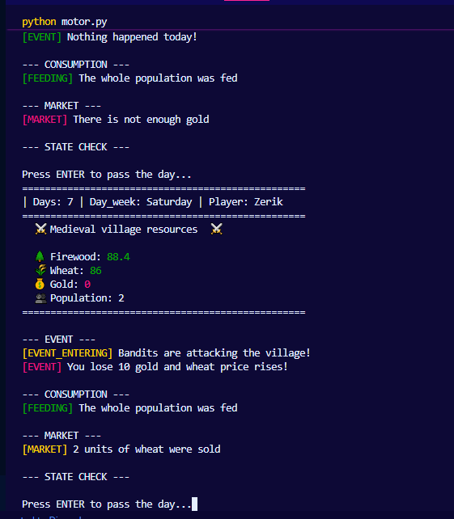

# Survival to the Extreme - Medieval Winter Village Simulator

**Medieval Village Administration**

<p align="center">
   
</p>

A turn-based console survival game in which the player manages a medieval village through 10 days of winter. The objective is to keep the population alive by administering three critical resources: firewood, wheat, and gold.

---

## Table of Contents

- [How the Game Works](#how-the-game-works)
- [Project Structure](#project-structure)
- [Requirements](#requirements)
- [Installation](#installation)
- [How to Run](#how-to-run)
- [How to Play](#how-to-play)
- [Daily Scrum Log](#daily-scrum-log)

---

## How the Game Works

Each game session lasts 10 in-game days. On every day, the following sequence occurs in order:

1. The current resource status is displayed on the console with color-coded feedback.
2. A random event may occur (blizzard, bandit attack, epidemic, etc.). Losses are shown in red.
3. Resources are consumed based on population, with a day-of-week modifier applied to one randomly selected resource.
4. Market logic is applied automatically depending on the wheat price.
5. The game checks whether any defeat condition has been met.

The player wins by surviving all 10 days without running out of firewood, wheat, or population.

### Difficulty Levels

| Difficulty | Firewood | Wheat | Gold | Event Impact |
|------------|----------|-------|------|--------------|
| Easy (1)   | 100      | 100   | 100  | Low          |
| Normal (2) | 50       | 50    | 50   | Medium       |
| Hard (3)   | 20       | 20    | 20   | High         |

Population is randomly assigned between 2 and 6 for all difficulty levels.

### Defeat Conditions

The game ends immediately if any of the following occurs:

- Firewood reaches 0 (the population freezes)
- Wheat reaches 0 (the population starves)
- Population reaches 0

### Day-of-Week Consumption Modifier

Each day, one resource (firewood or wheat) is randomly selected to receive a consumption modifier based on the current day of the week:

| Day                  | Modifier       |
|----------------------|----------------|
| Monday, Tuesday      | -20% (x0.8)    |
| Wednesday - Friday   | No change (x1.0)|
| Saturday, Sunday     | +20% (x1.2)    |

The other resource (the one not selected) always consumes at the base rate.

### Market Logic

The village market operates automatically each turn:

- If the wheat price is at or above 12, the village sells 2 units of wheat in exchange for gold.
- If the wheat price is at or below 10, the village buys 2 units of wheat using gold.
- At a standard price (between 10 and 12), no market action is taken.

### Random Events

Events are governed by a probability system scaled to the chosen difficulty. The harder the difficulty, the higher the chance of a negative event occurring. Resource losses are displayed in red in the console. Possible events include:

- Snowstorm: firewood loss
- Plague: wheat loss
- Bandit attack: gold loss and wheat price increase
- River freeze: wheat loss
- Blizzard: firewood loss
- Epidemic: wheat loss and wheat price increase
- Cold wave: firewood loss
- Food storage freeze: wheat loss
- Nothing: no effect (shown in green)

---

## Project Structure

```
.
├── motor.py        # Main game loop. Orchestrates the full day cycle.
├── inicio.py       # Handles player name input and difficulty selection.
├── eventos.py      # Random event generation and application.
├── consumo.py      # Daily resource consumption and market logic.
├── estado.py       # Validates resource limits and checks defeat conditions.
├── interfaz.py     # Console display with color-coded resource output.
├── pruebas.py      # Unit tests for all modules.
├── README.md       # This file.
└── LOG.md          # Daily Scrum records for all team members.
```

### Module Responsibilities

**motor.py** is the entry point of the game. It imports and coordinates all other modules, runs the main `while` loop across 10 days, and decides whether the player has won or lost. The `init_engine()` function returns a `tuple[str, str, dict[str, int | float]]` with the player's name, chosen difficulty, and initial resources.
    
**inicio.py** prompts the player for their name and difficulty preference, then initializes the `resources` dictionary that is passed through the rest of the game.

**eventos.py** uses `random.randint` to select a daily event. Probability thresholds are calculated dynamically based on difficulty. Each event modifies the `resources` dictionary directly. Resource losses are printed in red using `colorama`; a peaceful day is printed in green.

**consumo.py** deducts firewood and wheat each day based on population size. On each turn, one resource is randomly selected to receive a day-of-week modifier (weekends cost 20% more, Mondays and Tuesdays cost 20% less). The `market_logic` function handles automatic buying and selling of wheat based on the current price.

**estado.py** normalizes any negative resource values to zero, then checks whether any defeat condition applies. Returns `True` if the game continues, `False` if the player has lost.

**interfaz.py** uses `colorama` to display resources with color feedback: red when the quantity is below 60, yellow between 60 and 80, and green above 80. It also shows the current day number, day of the week, and player name in a formatted header.

**pruebas.py** contains unit tests for all functions across the modules, ensuring that logic is correct and edge cases are handled.

---

## Requirements

- Python 3.10 or higher
- pip
- The `colorama` library

---

## Installation

### 1. Clone the repository

```bash
git clone https://github.com/https://github.com/Zerik-Official/Survival-Economy-Simulator
cd Survival-Economy-Simulator
```

### 2. Create a virtual environment

Using a virtual environment isolates project dependencies from your global Python installation.

```bash
python -m venv venv
```

### 3. Activate the virtual environment

On Linux or macOS:

```bash
source venv/bin/activate
```

On Windows (Command Prompt):

```bash
venv\Scripts\activate.bat
```

On Windows (PowerShell):

```bash
venv\Scripts\Activate.ps1
```

Once activated, your terminal prompt will show the environment name, for example: `(venv)`.

### 4. Install dependencies

To install from an existing `requirements.txt`:

```bash
pip install -r requirements.txt
```

---

## How to Run

Make sure the virtual environment is active, then run the main engine file:

```bash
python motor.py
```

All other modules (`inicio.py`, `eventos.py`, `consumo.py`, `estado.py`, `interfaz.py`) are imported automatically by `motor.py`. Do not run them directly.

---

## How to Play

1. Run `python motor.py`.
2. Enter your name when prompted.
3. Choose a difficulty level: 1 (Easy), 2 (Normal), or 3 (Hard).
4. Each day, the game displays your current resources and resolves a random event.
5. Press `ENTER` to advance to the next day.
6. Survive all 10 days without losing firewood, wheat, or your entire population to win.

### Tips

- On Hard difficulty, resources are scarce from the start. Any event can end the game early.
- The wheat price rises after bandit attacks and epidemics. When it reaches 12 or above, the market will automatically sell wheat to generate gold.
- Population size directly affects daily consumption. A larger population drains resources faster.
- Weekends (Saturday and Sunday) increase consumption of one resource by 20%. Entering a weekend with low reserves is dangerous.
- Resource colors on the display indicate urgency: red means a critical shortage is near.

---

## Daily Scrum Log

All Daily Scrum records, including individual developer updates, blockers, and decisions made during the project, are documented in [LOG.md](./LOG.md).

The log covers the following sessions:

- **01/03/26** - Initial planning and task distribution across all team members.
- **02/03/26** - First implementation efforts per module; initial Git integration issues noted.
- **03/03/26** - Base logic defined for most modules; English translation applied for consistency.
- **04/03/26** - Core functions implemented across all modules; Git authentication issues resolved for some members.
- **05/03/26** - MVP consolidation; workflow standardized to a single `dev` branch; full module integration verified.
- **06/03/26** - MVP presented to the client; positive feedback received; improvements to balance and interface clarity planned.
- **07/03/26** - Day-of-week consumption modifier implemented; `colorama` added to event output; engine return type corrected; interface formatting improved.

---

## Team

| Role          | Name             | Module                  | Profile                          |
|---------------|------------------|-------------------------|----------------------------------|
| Developer     | Deyanis Martelo  | inicio.py               | https://github.com/laimenmejia18 |
| Developer     | Laimen Mejia     | inicio.py               | https://github.com/Deymartelo22  |
| T.L           | Melissa Garrido  | motor.py                | https://github.com/melissagarridos |
| Developer     | Saul Uribe       | eventos.py              | https://github.com/Sauhul        |
| Product Owner | Angela Manjarres | consumo.py              | https://github.com/angelamanjarres9-del |
| Developer     | Elianis Cervantes| interfaz.py             | https://github.com/elianis20     |
| Developer     | Juan Jose Varela | estado.py               | https://github.com/IamJuan201    |
| Scrum Master  | Gustavo          | README / LOG            | https://github.com/Zerik-Official |


> Project version 1.0